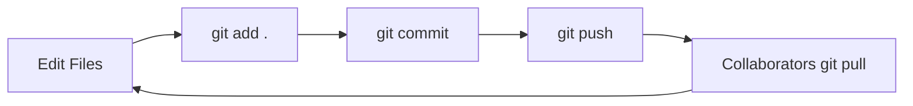

# 🌱 Git basics for beginners: Your project time machine ⏳

> **Git is like a super-powered "Save Game" system for your projects!**  
> It helps you:
> - Save different versions of your work 📁
> - Go back to previous versions if you make mistakes ↩️
> - Collaborate with others without file conflicts 👥
> - Store your projects online safely ☁️

---

## 🛠️ Step 1: Install git

### On Linux:
```bash
sudo apt install git-all
```
> 💻 **What this does**: Installs Git on your computer. You only need to do this once!

---

## 👤 Step 2: Introduce yourself to git

```bash
git config --global user.name "Alex Johnson"
git config --global user.email "alex@example.com"
```
> 📝 **Why this matters**: Git needs to know who's making changes.  
> 🔄 **Replace** with **your** name and email!

---

## 🚀 Step 3: Start using git in your project

1. Open your project folder in terminal:
   ```bash
   cd ~/projects/my-awesome-website
   ```
2. Initialize Git:
   ```bash
   git init
   ```
> ✨ **What happens**: This creates a hidden `.git` folder that tracks all changes.

---

## 💾 Step 4: Save your work (Take a snapshot)

### A. Stage your files (prepare for saving)
```bash
git add .
```
> 📦 **What this does**: Selects all changed files for saving.  
> 🔍 Want to add specific files? Use `git add filename.txt`

### B. Commit your changes (save the snapshot)
```bash
git commit -m "Added homepage design"
```
> 💬 **Good commit messages**:  
> - "Fixed login button color" ✅  
> - "Updated documentation" ✅  
> - "Stuff" ❌ (Too vague!)

---

## 📥 Step 5: Copy a project from the internet

```bash
git clone https://github.com/user/project.git
```
> 🌐 **Example**: To get the freeCodeCamp website code:  
> ```bash
> git clone https://github.com/freeCodeCamp/freeCodeCamp.git
> ```
> 📁 **What happens**: Creates a new folder with the project.

---

## ☁️ Step 6: Upload to GitHub (Save online)

1. Connect to GitHub (do this once per project):
   ```bash
   git remote add origin https://github.com/yourname/yourproject.git
   ```
   > 🔗 **Note**: Create the empty repository on GitHub first!

2. Upload your work:
   ```bash
   git push origin main
   ```
> 🚀 **First time?** You'll need to login with your GitHub credentials.

---

## 🔄 Step 7: Get latest changes (Teamwork!)

```bash
git pull origin main
```
> 🤝 **Use this**: When working with others to get their updates.  
> 💡 **Do this daily** to stay up-to-date!

---

## 🔍 Handy git cheat sheet

| Command | What It Does | When to Use |
|---------|--------------|-------------|
| `git status` | Shows changed files | Before committing |
| `git log` | Shows history | To see past versions |
| `git diff` | Shows line-by-line changes | Before committing |
| `git restore file.txt` | Undo changes | After mistakes |
| `git help` | Shows help | Anytime! |

---

## 🖱️ Prefer buttons over commands? Try GitHub desktop!

[](https://desktop.github.com/)

**Download**: [desktop.github.com](https://desktop.github.com/)  
**Perfect for you if**:
- You're just starting out
- You prefer visual interfaces
- You work mainly on your own projects

> ✅ Same Git power - no terminal needed!

---

## 🌈 Beginner workflow summary

1. `git add .` → Stage changes
2. `git commit -m "Message"` → Save snapshot
3. `git push origin main` → Upload to cloud
4. `git pull origin main` → Get updates (when working with others)



---

## 🎉 Congratulations! You've got git superpowers! 💪

**Next Steps**:
- Try making your first GitHub repository
- Commit small changes daily
- Explore GitHub's "Issues" for project tracking

> 💬 Remember: Every expert was once a beginner. Happy coding! 🚀
