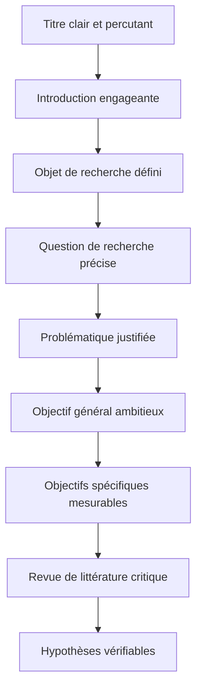
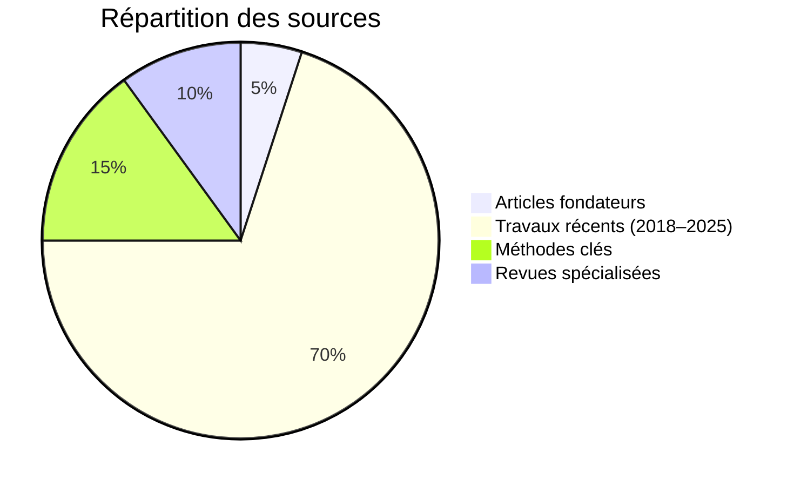

# Guide des composantes essentielles d’un projet de recherche en physique

> *"La recherche, c’est voir ce que tout le monde a vu, et penser ce que personne n’a pensé."*  
> **Albert Szent-Györgyi, Prix Nobel de Physiologie ou Médecine**

Ce guide détaille les étapes clés pour concevoir un projet de recherche en physique, avec des exemples concrets en physique quantique et moléculaire. Il s’adresse aux chercheurs en formation souhaitant structurer efficacement leur travail.

---

## Structure d’un projet de recherche

| **Composante** | **Rôle** | **Exemple en physique quantique** |
|----------------|----------|-----------------------------------|
| **Titre** | Résume l’essence du projet en captant l’attention. Doit être précis et évocateur. | *"Contrôle précis des vibrations moléculaires par impulsions laser ultrarapides"* |
| **Introduction** | Pose le contexte, explique pourquoi le sujet est important et introduit la problématique. | *"La manipulation des états quantiques dans les molécules ouvre la voie à des applications en calcul quantique. Cette étude explore..."* |
| **Objet de recherche** | Définit le champ d’étude général et le sujet spécifique. | **Champ général** : Dynamique moléculaire **Sujet spécifique** : Contrôle des vibrations dans le CO₂ |
| **Question de recherche** | Formule clairement la question scientifique à résoudre. | *"Comment ajuster les impulsions laser pour contrôler les vibrations moléculaires dans des molécules asymétriques ?"* |
| **Problématique** | Explique pourquoi cette question est pertinente et originale, en identifiant les lacunes actuelles. | *"Les techniques actuelles (FROG, SPIDER) peinent à contrôler les molécules asymétriques (Dimitrov et al., 2021). Nous proposons une nouvelle méthode basée sur..."* |
| **Objectif général** | Décrit l’ambition globale du projet. | *"Mettre au point un protocole pour contrôler les vibrations moléculaires avec une précision de 5 femtosecondes."* |
| **Objectifs spécifiques** | Liste les étapes concrètes pour atteindre l’objectif général. | 1. Simuler l’interaction laser-molécule 2. Construire un dispositif à impulsions laser 3. Mesurer les vibrations par spectroscopie |
| **Revue de littérature** | Analyse les travaux existants pour justifier l’originalité du projet. | *"Zhang et al. (2020) ont réussi à contrôler des molécules symétriques, mais leur méthode échoue pour les systèmes asymétriques car..."* |
| **Hypothèses** | Propose des prédictions testables basées sur la théorie. | *"Une séquence d’impulsions laser déphasées de π/4 augmentera la population de l’état vibrationnel v=2 dans le CO₂ de 30 %."* |

---

## Étapes de construction du projet

Pour structurer votre projet, suivez ce flux logique :

---

## Conseils pour un projet percutant

### 1. Formuler une problématique claire
- **Relier théorie et pratique** : *"Comment notre modèle théorique de contrôle quantique peut-il être testé expérimentalement avec des lasers ?"*
- **Mettre en avant les enjeux** : Mentionnez les implications pour la recherche fondamentale (ex. : dynamique quantique) ou appliquée (ex. : spectroscopie, calcul quantique).

### 2. Définir des objectifs SMART
Adoptez la méthode SMART pour des objectifs clairs :
- **Spécifique** : *"Mesurer le délai entre impulsions laser."*
- **Mesurable** : *"Avec une précision de 0,1 fs."*
- **Atteignable** : *"En utilisant un laser femtoseconde de 800 nm."*
- **Réaliste** : *"Avec l’équipement disponible au laboratoire."*
- **Temporel** : *"D’ici juin 2026."*

### 3. Réaliser une revue de littérature pertinente
- **Priorisez les sources récentes** (2018–2025) pour montrer que votre projet s’inscrit dans l’état actuel de la recherche.
- **Analysez, ne décrivez pas** : Comparez les forces et limites des travaux existants.
- **Sources fiables** :
  - *Physical Review Letters*
  - *Nature Photonics*
  - *Journal of Chemical Physics*
  - *Optics Express*

---

## Pièges à éviter

1. **Problématique floue**  
   ❌ *"Étudier les lasers et les molécules."*  
   ✅ *"Contrôler l’état vibrationnel v=2 du CO₂ avec des impulsions laser."*

2. **Objectifs trop généraux**  
   ❌ *"Explorer la dynamique quantique."*  
   ✅ *"Mesurer le transfert d’énergie entre états vibrationnels par spectroscopie."*

3. **Revue descriptive**  
   ❌ Résumer des articles sans analyse.  
   ✅ *"La méthode de Zhao et al. (2022) est limitée par une faible résolution temporelle, contrairement à notre approche qui..."*

4. **Hypothèses non testables**  
   ❌ *"Le contrôle quantique est réalisable."*  
   ✅ *"Un déphasage de π/4 entre impulsions augmentera la population de l’état v=2 de 25 ± 5 %."*

---

## Exemple concret : Contrôle des vibrations moléculaires

**Titre** : Contrôle précis des vibrations moléculaires par impulsions laser ultrarapides  
**Question centrale** : Comment ajuster la phase des impulsions laser pour contrôler sélectivement les vibrations dans des molécules asymétriques ?  
**Problématique** : Les techniques actuelles (FROG, SPIDER) manquent de précision pour les molécules asymétriques (Dimitrov et al., 2021). Nous proposons une méthode basée sur des séquences d’impulsions corrélées pour dépasser ces limites.  
**Objectif général** : Développer un protocole pour contrôler les vibrations moléculaires avec une fidélité supérieure à 95 %.  
**Objectif spécifique** : Construire un interféromètre stabilisé pour générer des impulsions laser avec un contrôle de phase précis à 0,1 radian.  
**Hypothèse** : Une séquence de trois impulsions laser, avec des délais de 15 ± 0,5 fs et 30 ± 0,5 fs, maximisera la population de l’état v=3 dans le NO₂ avec une fidélité de 90 %.
